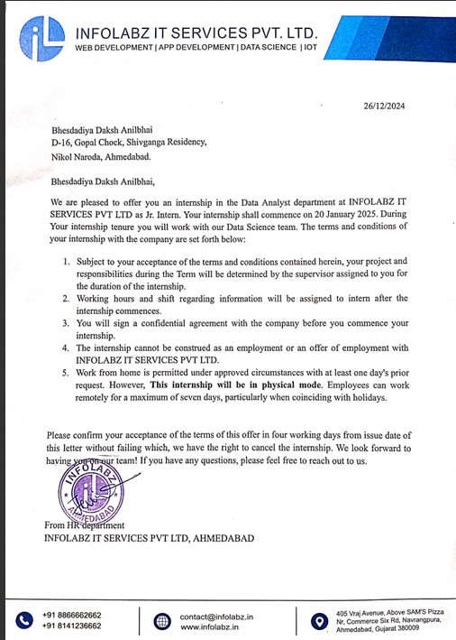

# DataScience_Internship
 This repository contains my day-wise work and progress during my Data Science Internship at Infolabz (Jan 2025). It includes project tasks, code implementations, data analysis, and key learnings from each day. The goal is to track my development, document challenges faced, and showcase my hands-on experience in data science  I also Mention my internship offer latter..

